# Shared memory
## Introduction
El presente es un trabajo práctico de laboratorio cuyo objetivo es el de diseñar una solución aplicando el paradigma de memoria distribuida, en lenguaje C, utilizando OpenMP.\
Se debe desarrollar un algoritmo de reconocimiento de patrones en imágenes. Para ello, se proporciona una imagen monocromática en formato PNG y un cierto target deseado (en el mismo formato), a partir de los cuales se debe indicar las coordenadas donde se encuentra el target en la imagen en cuestión.\
Una vez realizado, se debe adaptar la solución para comparar la ejecución de manera procedural (single thread) y distribuida (paralelizada) y reportar las estadísticas de cambios.

## Startup
Para comenzar, se debe clonar el repositorio. Una vez hecho, podemos compilar todo el proyecto aprovechando el archivo makefile, con el comando `make all` o, simplemente `make`. Esto compilará el proyecto con las flags indicadas en la consigna: `-Wall -pedantic -Werror -Wextra -Wconversion -std=gnu11`.\
Para optimizar el código y no perder precisión matemática, se agrega la flag `-O2`. Además, como se trabajará con la librería OpenMP, se agrega la flag `-fopenmp`

## Development
### The algorithm
El algoritmo desarrollado consiste en desplazar el target por la imagen principal y hallar la posición en la que ambas imágenes coincidan exactamente.\
Siendo <!-- $\color{white}T$ -->  el patrón a hallar, <!-- $\color{white}W_n$ --> 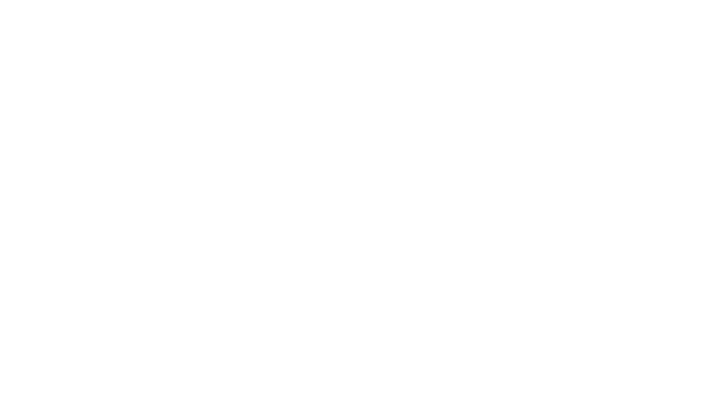 el n-ésimo desplazamiento de <!-- $\color{white}T$ -->  sobre la imagen principal, <!-- $\color{white}w_T$ -->  el ancho (en pixeles) del target, y <!-- $\color{white}h_T$ --> 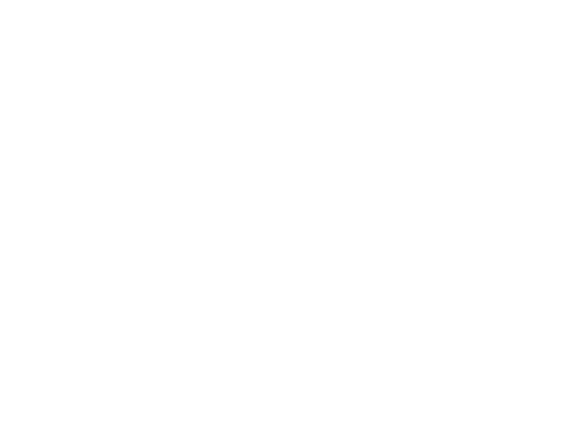 el alto (en pixeles) del target, se calcula la distancia euclideana entre el patrón buscado y el contenido de la imagen en la posición donde se encuentra el patrón de la forma:

<!-- $$
\color{white} dist(T, W_n) = \sqrt{\sum_{i=0}^{w_T - 1}\sum_{j=0}^{h_T - 1} (T(i,j) - W_n(i,j))^2}
$$ -->

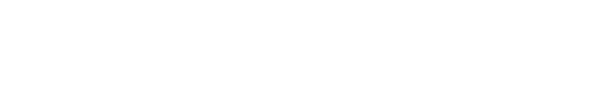

Luego de recorrer el patrón por toda la imagen y haber calculado todas las distancias euclideanas, se busca la menor de ellas y se reportan sus coordenadas correspondientes sobre la imagen principal.

### Established criteria
- El target comenzará posicionado en la esquina superior izquierda de la imagen principal y recorrerá de izquierda a derecha y de arriba a abajo, desplazándose un pixel a la vez.
- Con el fin de simplificar el trabajo, se reportarán las coordenadas del último punto en el que la distancia calculada entre las imágenes sea 0. Esto se logra cuando el target es un recorte extraído directamente de la imagen principal.
    - Al manejar este criterio de encontrar un match perfecto, podemos prescindir completamente de la matriz de distancias. Simplemente calculamos cada elemento y sólo reportamos las coordenadas en aquel punto cuyo resultado dio 0.
- Para minimizar el overhead de operaciones matemáticas, no se calculará la raíz cuadrada de los sumatorios. De igual manera el match dará 0.
- Las coordenadas reportadas corresponden al punto de la esquina superior izquierda de la posición del match del target en la imagen principal.
- Se trabajará con el formato PGM para obtener la información de interés de las imágenes en forma de matriz en <!-- $\color{white}R^2$ --> 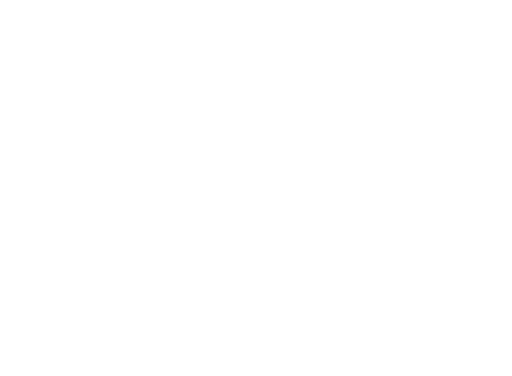 de escala de grises, cada celda representando un pixel de las imágenes.
- Se convertirán las imágenes de formato PNG a PGM mediante un programa desarrollado en Python.
- Las coordenadas reportadas serán almacenadas en un archivo de texto que luego será abierto por un programa desarrollado en Python para dibujar en la imagen principal un rectángulo indicador de la zona de match, mostrando en pantalla el resultado.

### Parallelization
El tipo de paralelismo que exhibe el problema en cuestión es, de acuerdo a la taxonomía de Flynn, del tipo SIMD (Single Instruction, Multiple Data). Se describe como una misma instrucción aplicada a múltiples datos distintos, las cuales pueden ser ejecutadas de manera paralela. Es un tipo de paralelismo típico, por ejemplo, en renderización, procesamiento de imágenes y en cálculos matriciales.\
En este trabajo estamos manejando dos matrices bidimensionales con la escala de grises de las imágenes principal y patrón, y por cada desplazamiento del patrón sobre la imagen principal aplicamos la misma instrucción a los datos de las matrices, almacenando el resultado en una variable acumuladora.\
Para paralelizar este trabajo, se hizo uso de las directivas ofrecidas por OpenMP. La función que calcula las distancias (`get_match`) consta de cuatro bucles `for` anidados, y para lograr que se ejecute con un número `total_threads` de hilos, se agrega —sobre la declaración del bucle exterior— la directiva: `#pragma omp parallel for private(i, j, k, l, acc) num_threads(total_threads) schedule(dynamic)`.\
De esta manera, indicamos que los bucles for se ejecutarán de manera paralela con `num_threads` hilos, manteniendo cada uno una copia privada (propia) de las variables de iteración `i`, `j`, `k` y `l`, y de la variable acumuladora `acc`. Esto logra reducir y paralelizar los bucles `for` agilizando notablemente la ejecución del código. Además, se indica que el scheduling será dinámico: thread libre, thread que se utilizará para trabajar.

### Comparison
Las comparaciones realizadas fueron en base al tiempo de ejecución a la hora de hallar el target en la imagen principal proporcionada para este trabajo, utilizando un procesador `AMD Ryzen 5 3600` de 6 cores, 12 threads.\
Para testear cuánto tiempo tarda la ejecución del programa, no se pudo utilizar la herramienta de profiling `gprof` ya que la misma cronometra la ejecución, suma los tiempos de cada thread y muestra el resultado como tiempo de ejecución total.\
En este caso se hizo uso de la sencilla herramienta `time` para cronometrar el tiempo de cada ejecución.\
A continuación se muestran capturas del output de `time` para las ejecuciones realizadas:

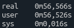\
*Figura 1: Tiempo transcurrido en ejecución monohilo.*

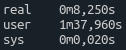\
*Figura 2: Tiempo transcurrido en ejecución con 12 threads.*

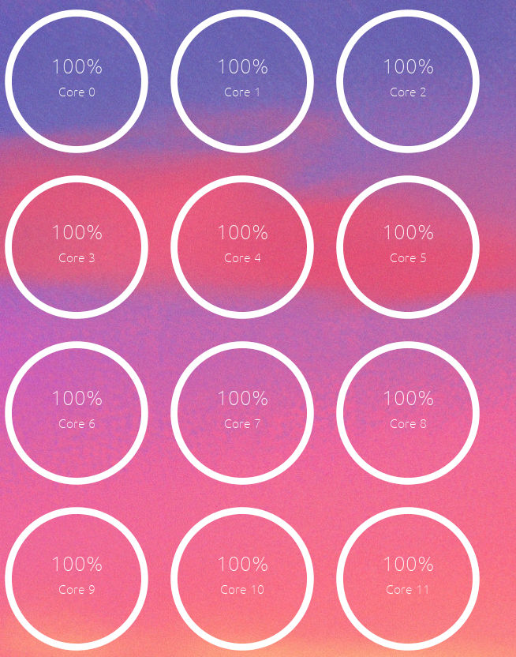\
*Figura 3: Prueba de la utilización de todos los cores del CPU al usar la máxima cantidad de threads reales.*

Realizando pruebas con más de 12 threads no hubo mejora significativa alguna.\
Con un sencillo cálculo podemos obtener que entre los casos extremos (monothread y con 12 threads reales) se obtuvo una mejora promedio del 85% en cuanto a velocidad de ejecución.

## Ease of use
Se provee un bashscript llamado `run`. Al ejecutarlo, se le pedirá al usuario los nombres de las imágenes necesarias (imagen principal y patrón a buscar), las cuales deben estar situadas dentro de la carpeta `img`, y la cantidad de threads con los que se quiere ejecutar el programa. Luego, el script se encarga de compilar y ejecutar todo lo necesario.\
Si el usuario ingresa `1` como cantidad de threads, entonces el programa se ejecutará de manera procedural (single-thread). Caso contrario, se utilizarán tantos threads de manera paralela como se hayan especificado.

## Screenshots
A continuación se proveen algunos screenshots de tests hechos, junto con el resultado del test con las imágenes provistas originalmente para este trabajo:

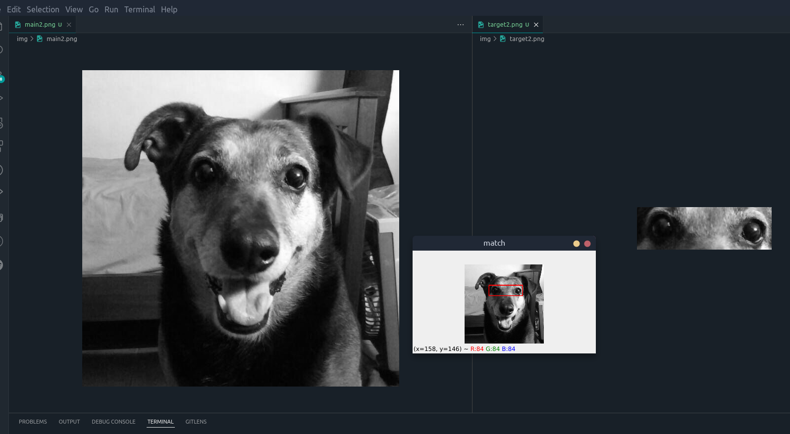\
*Figura 4: Test con reconocimiento de ojos en imagen de un animal.*

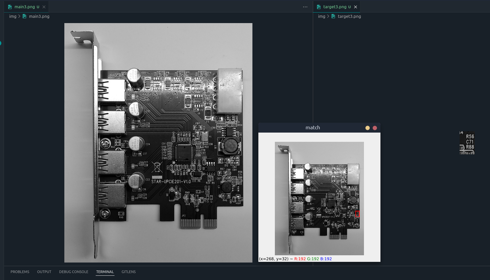\
*Figura 5: Test con reconocimiento de inscripciones en imagen de una placa electrónica.*

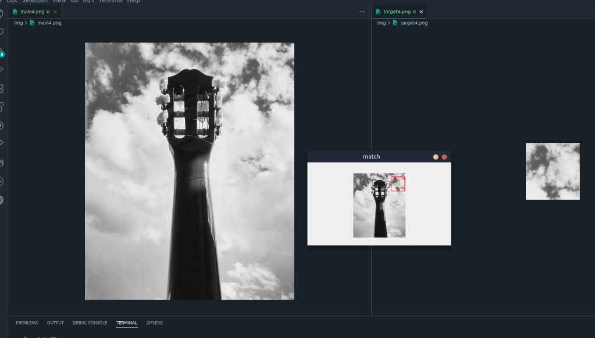\
*Figura 6: Test con reconocimiento de porción de cielo en imagen de un objeto al aire libre.*

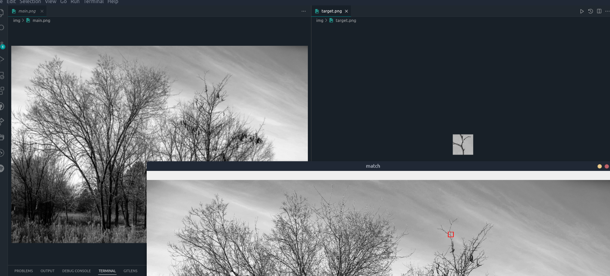\
*Figura 7: Test con reconocimiento de rama en imagen de una arboleda/parque.*

## Known issues
- El programa sólo funciona con imágenes monocromáticas en formato PNG.
- Si el target no es un recorte extraído de la imagen principal, no se hallará un match.
